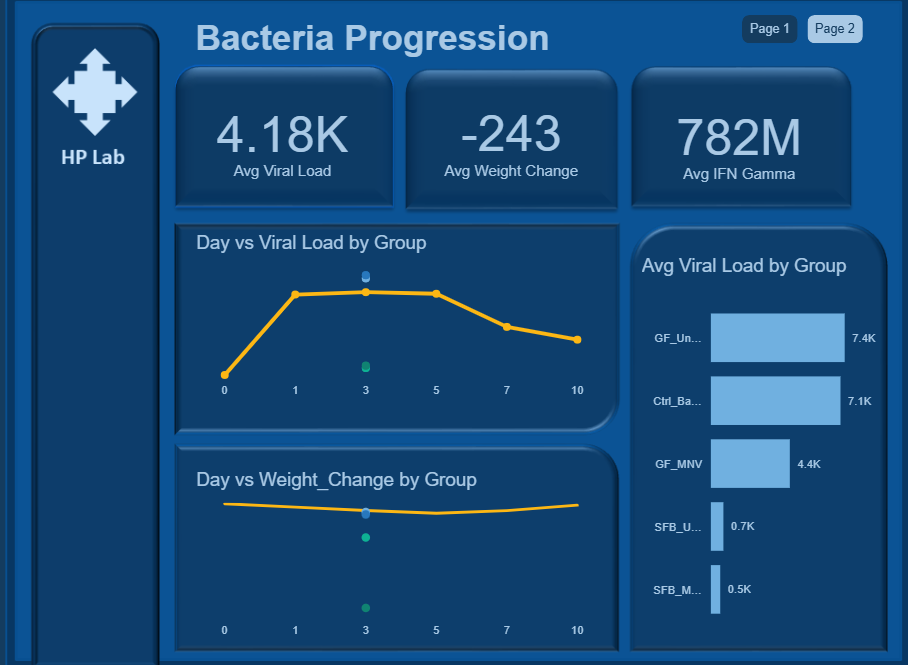
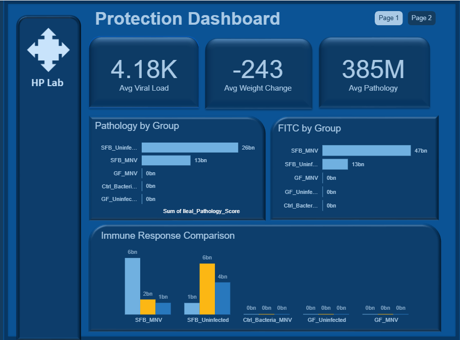

## Project Overview

This project analyzes experimental biological data to understand how different bacterial treatments influence viral infection outcomes.
The analysis focuses on three key indicators of infection severity:
* Viral Load
* Weight Change
* Immune Response (IFN Gamma)
* Pathology Score
Using Power BI dashboards, the study identifies which bacterial treatments provide the strongest protective effect against viral infection.

## Data Cleaning Process

* Removed blank rows
* Converted Day column to numeric
* Sorted infection timeline
* Checked for duplicate records
* Verified measurement consistency
* Validated group labels

## Data Explorations 

* Viral load progression across days
* Weight change trends during infection
* Immune response differences between groups
* Tissue pathology severity

## Key Metrics (KPIs)

* Average Viral Load
* Average Weight Change
* Average IFN Gamma
* Average Pathology

## Analytical Approach

* Time Analysis
* Treatment Comparison
* Immune Response Analysis

## Dashboard

Page 1 — Infection Progression
* Infection severity trends
* Viral load changes over time
* Weight loss progression
* Treatment comparisons

Page 2 — Protection Analysis
* Pathology score by group
* FITC immune response
* Overall immune comparison

## Key Insights

Insight 1 — Viral Load Progression: Viral load increases rapidly during early infection days and then gradually declines.
Insight 2 — Treatment Effectiveness: Some bacterial groups show significantly lower viral load, suggesting protective effects.
Insight 3 — Immune Response: Groups with stronger IFN Gamma levels show better infection control.
Insight 4 — Pathology Impact: Higher viral loads correspond with higher tissue pathology scores.

## Strategic Interpretation

The analysis suggests that specific bacterial strains influence infection outcomes by strengthening immune responses and reducing viral replication.

This supports the hypothesis that gut microbiota plays a protective role in viral infections.

## Limitations

* Small experimental sample size
* Limited time intervals 
* Biological variability

## Future Improvements

* Survival analysis
* Predictive modeling
* Correlation analysis

## Conclusion

This project demonstrates how data analytics can be used to analyze biological experiments and extract meaningful insights about infection progression and treatment effectiveness.
Using Power BI, the analysis highlights how bacterial treatments influence viral load, immune response, and tissue damage.

## Dashboard Preview

 ## 👨‍💻 Author

 ## *Samuel Adebayo*
Data Analyst | Power BI | Data Storytelling
